## Домашнее задание 1. Отчет по MongoDB

<font color="green"><h4>Ахмаджонов Мумтозбек</h4></font>

- <h3>Шаг первый</h3>

Установим MongoDB Community Version 5.0 локально: (через установщик `.msi`, и просто все оставляем по умолчанию)


```python
from IPython.display import display, Image
```


```python
for i in range(1, 10):
    print(f"Шаг {i}:")
    display(Image(url=f"{i}.png"))
```

    Шаг 1:
    


    Шаг 2:
    


    Шаг 3:
    


    Шаг 4:
    


    Шаг 5:
    


    Шаг 6:
    


    Шаг 7:
    


    Шаг 8:
    


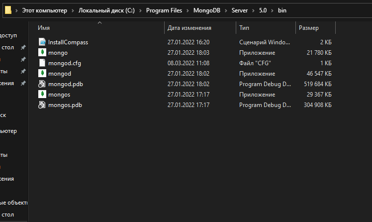


    Шаг 9:
    


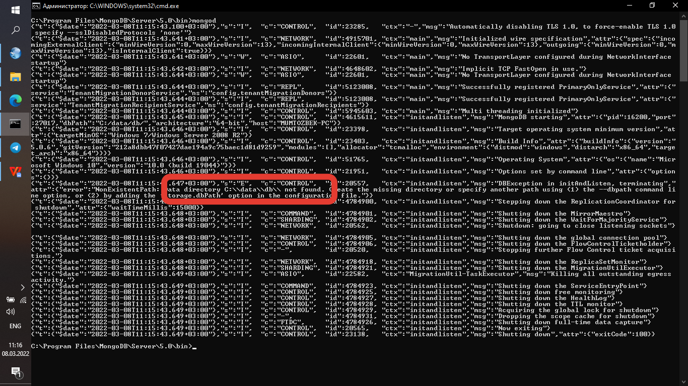


Как можно увидеть, на последнем скрине, сервер монги не запустился из-за отсутствия директория `C:/data/db`. Просто создадим эту директорию и перезапустим сервер, заодно и запустим и консольку монги и убедимся что все работает корректно:


```python
display(Image(url="10.png"))
```


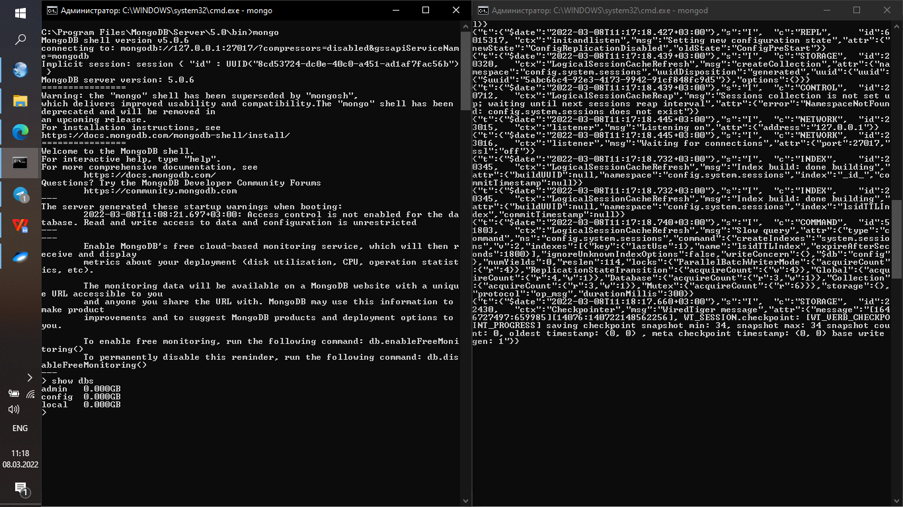


- <h3>Шаг второй</h3>

Создадим базу данных `task1` и collection `sample`. И заимпортим туда данные `jobs.tsv` которые я скачал из кеггл. датасет содержит ифнормацию о вакансиях в различные периоды времени в США с описанием работы и требований, а так же с информацией о локации работы.


```python
for i in range(11, 16):
    print(f"Шаг {i}:")
    display(Image(url=f"{i}.png"))
```

    Шаг 11:
    


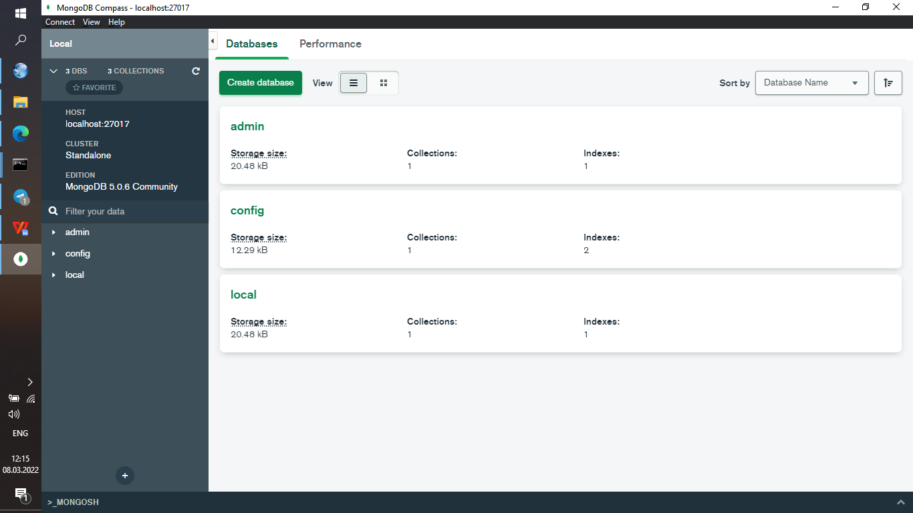


    Шаг 12:
    


    Шаг 13:
    


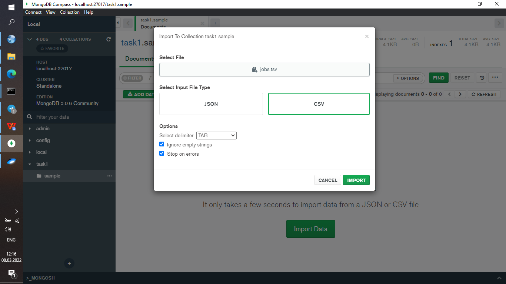


    Шаг 14:
    


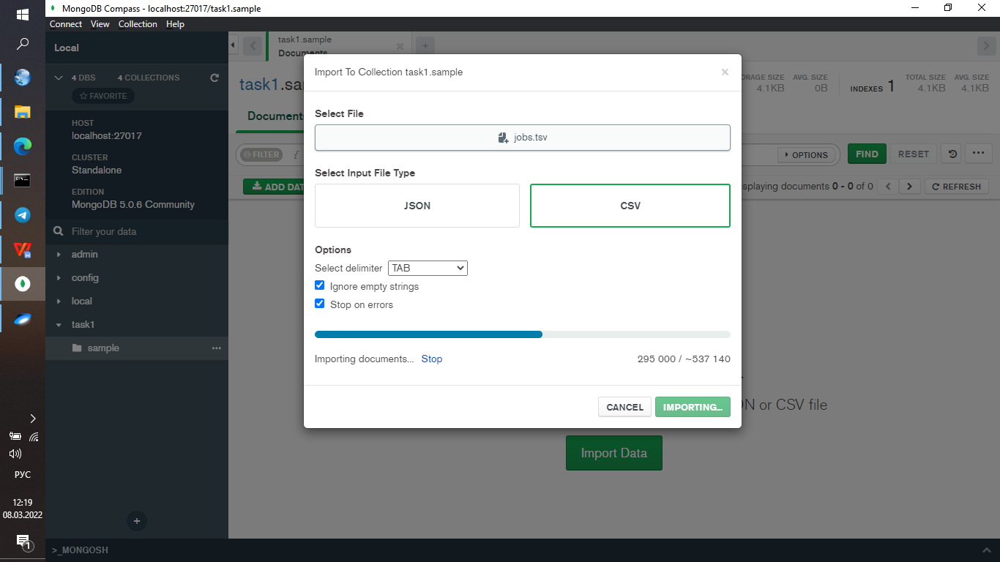


    Шаг 15:
    


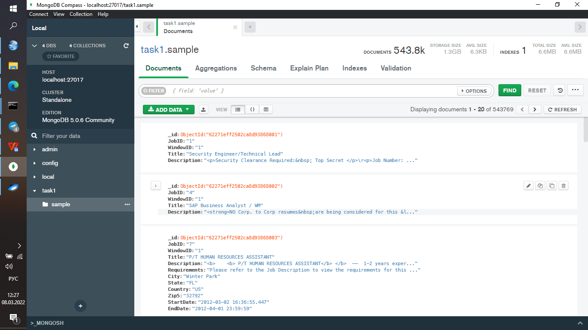


- <h3>Шаг третий</h3>

Попробуем поискать все вакансии с `"JobId": "4"`:


```python
display(Image(url="16.png"))
```


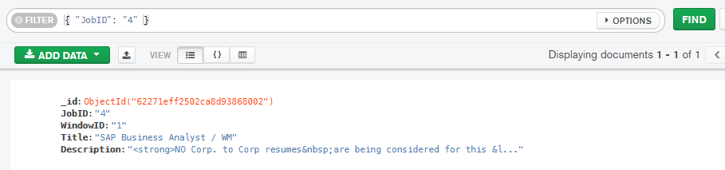


Посмотрим на детали запроса:


```python
display(Image(url="17.png"))
```


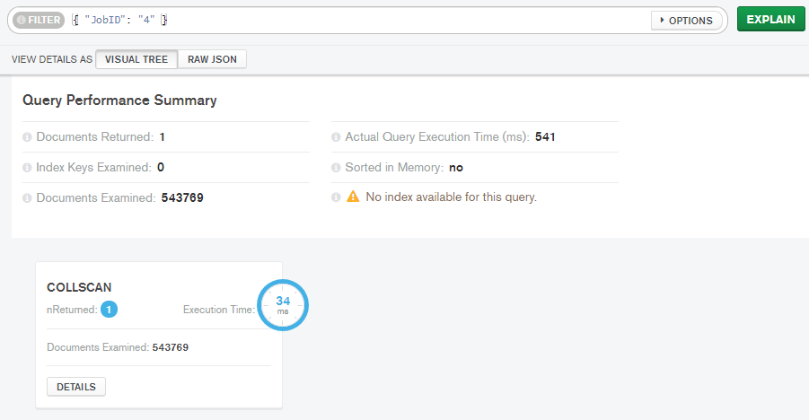


Видим, что индекса под это поле нет в базе данных, поэтому при поиске рассматриваются все документы. Создадим индекс и еще раз посмотрим на детали запроса:


```python
for i in (18, 19):
    display(Image(url=f"{i}.png"))
```


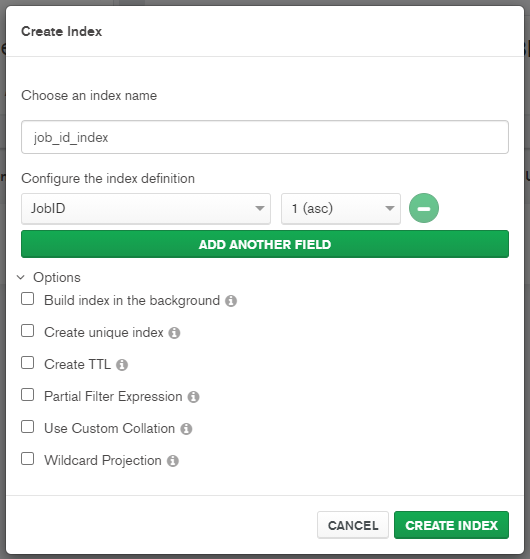


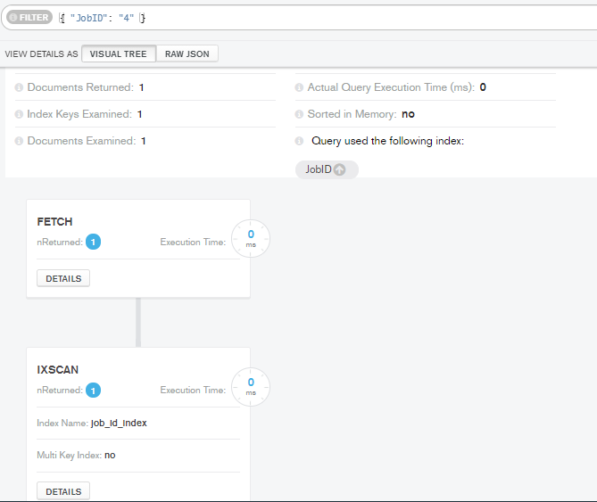


Как видим, производительность очень значительно увеличилась, за счет индексации, и рассматривается только один документ, т.е. тот что имеет такое значение поля `JobID`.

Пробуем теперь поискать все вакансии в чьих полях `Description` или `Title` содержится слово "analyst". Заметим, что для поиска обязателен индекс типа `text` на соответствующих полях. Т.е. тут производительность не сравнить:


```python
for i in range(20, 24):
    display(Image(url=f"{i}.png"))
```


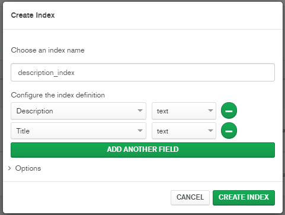


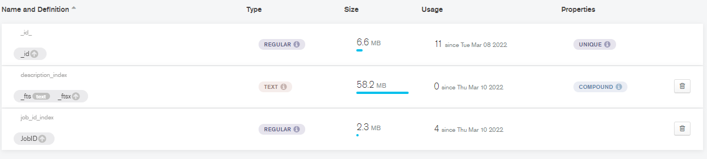


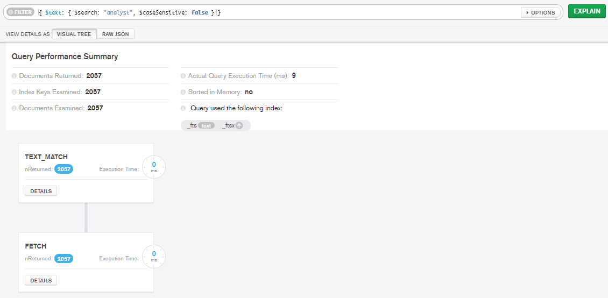


Замечаем, что каким-то чудом благодаря индексу, рассмотрелись только те документы которые подходят нашему запросу.

Теперь же, дропнем индекс у поля `Description` и попробуем поискать слово "Please" через регулярное выражение:


```python
display(Image(url="25.png"))
```


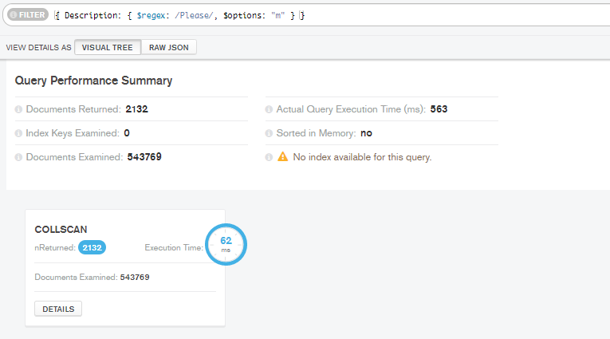


Как видим, ситуация намного хуже когда нет индекса, т.е. паттерн регулярки ищется в каждом поле, что может отобрать колоссальное количество ресурсов и времени.

Напишем еще один запрос для разнообразия:


```python
display(Image(url="26.png"))
```


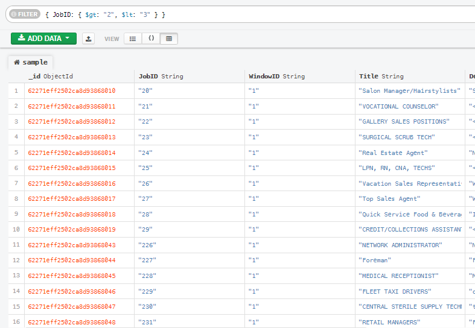


Ожидали увидеть что не выйдет ни один документ под таким запросом, но для MongoDB `"200" < "3"` это `true`, поэтому видим все документы с `JobID` начинающиеся с цифры 2. Такое поведение обсоновано тем, что в датасете нет цифр и все является строкой. Сравним снова же производительности c индексом и без:


```python
for i in (27, 28):
    display(Image(url=f"{i}.png"))
```


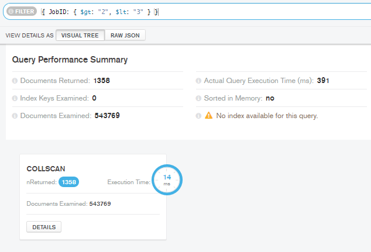


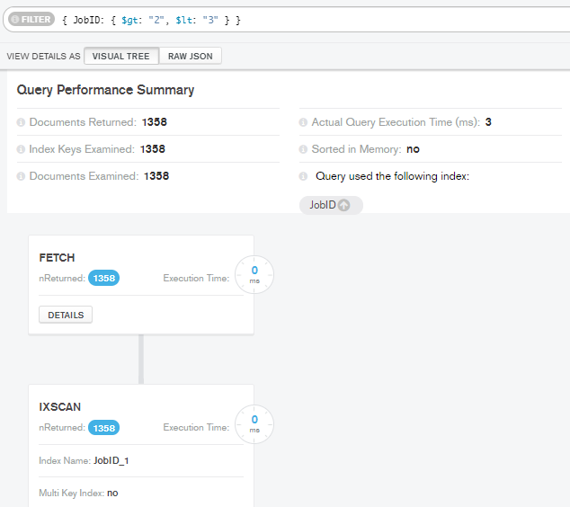


- <h3>Шаг четвертый</h3>

Сменим имя профессии у которого `JobID` равен "23", и сравним производительность с индексом:


```python
for i in (29, 30):
    display(Image(url=f"{i}.png"))
```


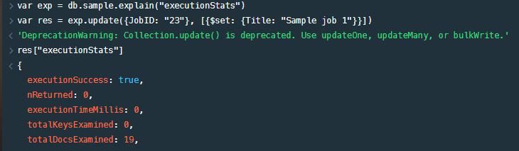


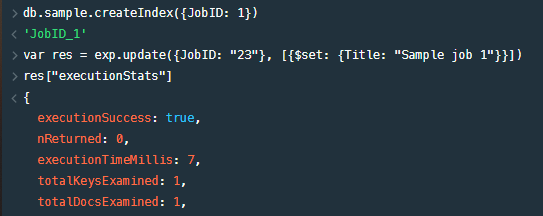


Как видим, создание индекса тут помогло сократить количество рассматриваемых документов, но время исполнения слегка увеличилось.

Теперь попробуем удалить этот документ и сравним проивзодительности:


```python
for i in (31, 32):
    display(Image(url=f"{i}.png"))
```


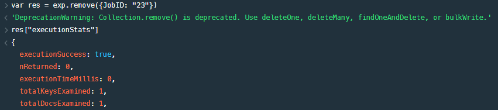


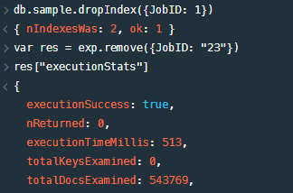


Тут индекс уже существенно помогает удалить документ, т.к. производится поиск уже в `B-tree`вместо линейного поиска когда нет индекса.

__Conclusion:__ Таким образом, рассмотрели базовые операции СУБД MongoDB, а так же поняли что в большинстве случаев индексация полей улучшает проивзодительность.


```python

```
