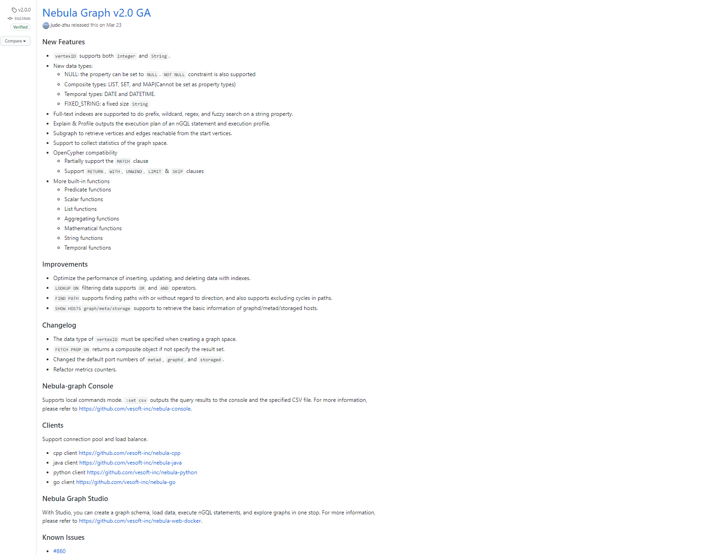
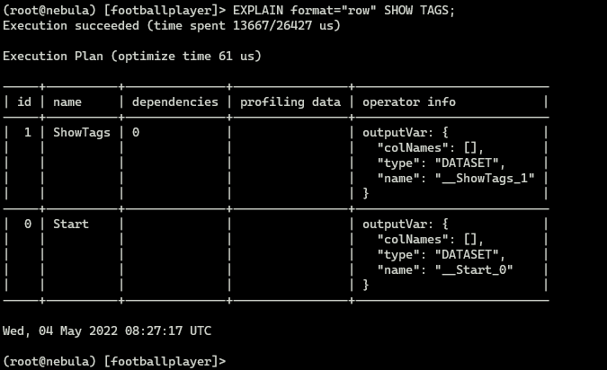

## Домашнее задание 4. Отчет по Nebula Graph

<font color="green"><h4>Ахмаджонов Мумтозбек</h4></font>


```python
from IPython.display import display, Image
```

- <h3>История развития БД</h3>

Nebula Graph была создана в 2018 году китайской компанией <a href="https://www.vesoft.com/en/">Vesoft Inc.</a>. Первые строчки кода данного БД написал <a href="https://github.com/dutor">dutor</a>. В 2019 году версия 0.1.0-alpha была выпущена как open-source. Подробные фичи показаны ниже в скриншоте:


```python
display(Image(url="./img/1.png"))
```


В том же году вышли и версии: v1.0.0-beta, v1.0.0-rc1, v1.0.0-rc2, v1.0.0-rc3, и v1.0.0-rc4. А также СУБД представили на конференции HBaseCon:


```python
display(Image(url="./img/2.png"))
```


В июне 2020 года был сделан самый значимый релиз:


```python
display(Image(url="./img/3.png"))
```


А в марте 2021 года был сделан релиз второй версии СУБД:


```python
display(Image(url="./img/4.png"))
```





В августе того года была выпущена версия v2.5.0:


```python
display(Image(url="./img/5.png"))
```


В феврале этого года увидела свет <a href="https://github.com/vesoft-inc/nebula/releases/tag/v3.0.0">третья</a> версия продукта.

- <h3>Инструменты взаимодействия с СУБД</h3>

Nebula Graph поддерживает множество различных видов клиентов для пользователей для подключения и управления базой данных:
- <a href="https://docs.nebula-graph.io/3.1.0/nebula-console/">Nebula Console</a>: нативный консольный клиент БД
- <a href="https://docs.nebula-graph.io/3.1.0/14.client/3.nebula-cpp-client/">Nebula CPP</a>: клиент для языка С++
- <a href="https://docs.nebula-graph.io/3.1.0/14.client/4.nebula-java-client/">Nebula Java</a>: клиент для языка Джава
- <a href="https://docs.nebula-graph.io/3.1.0/14.client/5.nebula-python-client/">Nebula Python</a>: клиент для языка Python
- <a href="https://docs.nebula-graph.io/3.1.0/14.client/6.nebula-go-client/">Nebula Go</a>: клиент для языка Golang

Помимо этих клиентов существует так же <a href="https://github.com/vesoft-inc/nebula-studio">Nebula Graph Studio</a> - браузерный инструмент для визуализации СУБД Nebula Graph:


```python
display(Image(url="./img/6.png"))
```


- <h3>Database Engine в Nebula Graph</h3>

Nebula Graph as is база данных, т.е. использует свой нативный движок. Но версии `v1.x` поддерживали движки `RockDB` и `HBase`, а начиная со второй версии БД, поддержка `HBase` прекратилась.

- <h3>Язык запросов `nGQL`</h3>

nGQL - это декларативный язык графовых запросов для СУБД Nebula Graph. Он позволяет создавать выразительные и эффективные графовые шаблоны (<a href="https://docs.nebula-graph.io/3.1.0/3.ngql-guide/1.nGQL-overview/3.graph-patterns/">graph patterns</a>). Он очень похож на SQL поэтому утверждается что легок в изучении. Важно отметить, что этот язык еще не докончен и постоянно вносятся какие то исправления и оптимизации.

nGQL поддерживает:
- обходы графов
- сопоставление шаблонов
- аггрегирование
- мутации графов
- управление доступом
- сложные запросы
- индексы
- синтаксис большинства графовых запросов openCypher 9 (кроме синтаксиса мутации и управления)

Так же поддерживаются различные типы данных: числовые, строковые, даты и времени, `NULL`, `list`, `set`, `map`, `geography`(подробнее <a href="https://docs.nebula-graph.io/3.1.0/3.ngql-guide/3.data-types/10.geography/">тут</a>).

По умолчанию, одна инстанция Nebula Graph состоит из однного или из многих графовых пространств. Графовые пространства физически изолированы друг от друга. Пользователи могут использовать различные пространства в одной и тоже же инстанции для хранения различных датасетов.


```python
display(Image(url="./img/7.png"))
```


Чтобы добавлять данные в графовое пространство, нужно определить схему для графовой бд. Схемы в Nebula Graph основываются на 4-х компонентах:


```python
display(Image(url="./img/8.png"))
```


Важно отметить, что в Nebula Graph команды `CREATE` и `ALTER` отреализованы асинхронным образом и срабатывают в <strong>следующем</strong> цикле "сердцебиения". Один цикл сердцебиения по умолчанию длится 10 секунд.

Так, приступим к рассмотрению важнейших операций, а точнее CRUD (create, read, update, delete). Посмторим какие у нас изначально имеются графовые пространства: 


```python
display(Image(url="./img/9.png"))
```


Создадим новое пространство под названием "footballplayers" с помощью команды `CREATE SPACE` с нужными атрибутами. О них можно детально узнать в документации ссылку на которой я оставлю позже:


```python
display(Image(url="./img/10.png"))
```


После указания `partition_num=15` проверим распределилась ли нагрузка сбалансированно по всам нашим хранилищам:


```python
display(Image(url="./img/11.png"))
```


Видим что все шикарно, значит можно использовать это пространство и добавлять туда данные. Сначала создадим теги вершин и виды ребер:


```python
display(Image(url="./img/12.png"))
```


Добавим вершины:


```python
display(Image(url="./img/13.png"))
```


И ребра:


```python
display(Image(url="./img/14.png"))
```


Для чтения данных используются команды: `GO`, `FETCH`, `LOOKUP` и `MATCH`. После примеров станет более менее понятно как ими пользоваться. А детальные описания команд есть в докмуентации.

Среди игроков на которые подписан игрок с VID `player101` выведем тех, чей возраст >= 35. Поменяем названия соотвестующих колонок на `Teammate` и `Age`:


```python
display(Image(url="./img/15.png"))
```


Чтобы посмотреть свойства объекта используется команда `FETCH PROP`:


```python
display(Image(url="./img/16.png"))
```


Для обновления данных используются команды `UPDATE` и `UPSERT`. Команда `UPSERT` добавит новый элемент если искомый не существует. Обновим имя игрока с `VID` `"player100"` и ребро `"player101" -> "player100"`:


```python
display(Image(url="./img/17.png"))
```


```python
display(Image(url="./img/18.png"))
```


Теперь удалим парочку вершин и ребер. Делается это просто командой `DELETE`:


```python
display(Image(url="./img/19.png"))
```


```python
display(Image(url="./img/20.png"))
```


- <h3>Распределение файлов БД по разным носителям</h3>

Nebula Graph состоит из трех сервисов:
- the Graph Service - отвечает за выполнение вычислений и запросов
- the Meta Service - занимается управлением метаданными: операции схем, администрацией кластера и управлением привилегиями пользователя
- the Storage Service - занимается хранением данных


```python
display(Image(url="./img/21.png"))
```


Storage Service хранит граф в виде `key-value` пар. Все распределение происходит именно в сервисе хранилища. Чтобы организовать эффективное распрпеделение данными, Nebula graph использует стратегию static Hash c опреацией деления с остатком на ID вершины. Таким образом все входящие и исходящие ключи и теги вершин останутся в одном разделении (partition). Каждый `partition` хранится в разных носителях как мы уже увидели в самом начале в примерах.

Помимо распределения данных, создаются несколько копий реплик для повышения отказоустойчивости системы в целом. Чтобы поддержать синхронизацию и совместимость между копиями реплик Nebula Graph использует алгоритм `Raft`. Детально можно ознакомиться с механизмами и алгоритмами в документации.

- <h3>Язык программировния на котором создан СУБД</h3>

Все движки СУБД включая вышеупомянутые сервисы написаны на `С++`, а встроенный консоль клиента `nebula-console` написан на `Golang`.

- <h3>Типы индексов поддерживаемые Nebula Graph</h3>

Для ускориения процесса выполнения запросов, Nebula Graph поддерживает два вида индексов: нативные и полнотекстные (native and full-text). 

Нативные индексы позволяют делать запросы на данные на основе каких-то свойств. Имеются следующие особенности нативных индексов:
- Есть два типа нативных индексов: индекс тегов и вида ребер.
- Нативные индексы нужно обновлять вручную. Для этого используется команда `REBUILD INDEX`.
- Нативные индексы поддерживают индексирование сразу нескольких свойств тега или вида ребер (composite indexes), но не позволябт индексировать несколько тегов или видов ребер.

Полнотекстовые индексы используются для выполнения поиска по префиксу, подстановочным знакам, регулярному выражению и нечеткому свойству строки (prefix, wildcard, regexp, fuzzy search). Особенности следующие:
- полнотекстовые индексы позволяют индексировать только одно свойство.
- Только строки размера не больше 256 байтов могут быть проиндексированы.
- Полнотекстовые индексы не поддерживают логические операции.

- <h3>Процесс выполнения запросов в Nebula Graph</h3>

Через команду `EXPLAIN` можно посмотреть как выполняется определенный запрос:


```python
display(Image(url="./img/26.png"))
```





Ниже в диаграмме можно увидеть примерную архитектуру как выполняется запрос обхода графа:


```python
display(Image(url="./img/24.png"))
```


Из самого важного, можно тут увидеть, что исполнение разделено на три части: parsing, validation и собственно execution.

- <h3>План запросов в Nebula Graph</h3>


```python
display(Image(url="./img/23.png"))
```


Как видим из диаграммы, после парсера идет планировщик запуска. Он же и планировщик запросов. Вскармливаем ему AST (Abstract Syntax Tree - результат парсинга текста запроса) и он выдает список действий(план запросов). Действие - наименьшая единица которая должна быть исполнения. Типичный действием считается чтение всех соседей данной вершины, чтение свойств ребра и фильтрация результата чтения по данным условиям. Например, как мы увидели раньше, запрос `SHOW TAGS` разделился на два действия: `Start` и `ShowTags`.

- <h3>Транзакции в Nebula Graph</h3>

Из-за совместимости с `openCypher 9` nGQL не поддерживает транзакций. Атомарность стараются поддержать инднивидуально для каждой команды.

- <h3>Методы восстановления</h3>

1) Backup & Restore (BR) - ксонсольный инструмент Nebula Graph для создания резервных копий графовых пространств и их восстановления. Инструмент поддерживает:
- создание бекапа и восстановления данных за одну клику
- восстановление данных их следующих видов бекап файлов:
  - локальный диск (SSD/HDD). Рекомендуется использовать только в тестовом окружении
  - интерфейс совместимый с Amazon S3: Alibaba Cloud OSS, MinIO, Ceph RGW, etc.
- создание бекапа и восстановление всего кластера Nebula Graph

2) Nebula Graph так же поддерживает использование снапшотов для бекапа и восстановления данных. Создается снапшпот через команду `CREATE SNAPSHOT`. Потом перетаскиваются созданные снапошоты в папку `data` и `wal` и перезапуском кластера данные восстанавливаются.

- <h3>Шардинг</h3>

Важно отметить, что шардинг графов является NP-трудной задачей. В Nebula Graph шардинг производится через стратегию `Static Hash` делится с остатком на id вершины. Можно посмотреть как это производится коде из официального репозитория Nebula Graph:


```python
display(Image(url="./img/27.png"))
```


- <h3>Data Mining, Data Warehousing, OLAP</h3>

Анализ данных в данном СУБД производится в основном тоже в графовом виде и для data mining и data analysis Nebula Graph представляет дополнительные расширения: `Nebula Algorithm`(приложение Spark основанный на GraphX) и `Nebula Analytics`(доступно только в Nebula Enterprise Edition). Для Data Warehousing и OLAP от разработчиков СУБД еще нет решений :(

- <h3>Методы защиты</h3>

Для реализации управления доступом nebula Graph использует методы локальной и LDAP аутентификации. Nebula Graph создает сессию когда клиент подключается к СУБД. Сессия содержит в себе информацию о соединении, а так же данные о пользователе. Если включена аутентификация, сессия отображается только соотвествующим пользователям.

В локальной аутентификации именя пользователей и зашифрованные пароли хранятся в локальных серверах. Помимо этого метода используется так же легоквесный протокол LDAP (Lightweight Directory Access Protocol) для доступа к директориям и построения централизованной системы управлениями учетными записями.

В Nebula Graph поддерживаются создание пользователей и распределение ролей между пользователями. Без включенной аутентификации все клиенты являются `root` пользователями. Существует роли: `GOD`, `ADMIN`, `DBA`, `USER`, `GUEST` (переисление по убыванию привилегий).

Nebula Graph так же поддерживает шифрование SSL во время обмена данными между клиентами и между сервисами.

- <h3>Разработчики Nebula Graph</h3>

Nebula Graph была разработана высокотехнологическим китайским стартапом Vesoft Inc. который бал основан в Октябре 2018. Команда в основном состоит из бывших инженеров FAANG компаний. В основном они занимаются анализом данных с использованием графовых технологий.

- <h3>Демобаза языка запросов</h3>

Пользователи могут найти более чем 2500 примеров на nGQL в репозитории Nebula Graph на Github, в разделе <a href="https://github.com/vesoft-inc/nebula-graph/tree/master/tests/tck/features">features</a>.

- <h3>Документация и контакты</h3>

- Основная документация по СУБД: https://docs.nebula-graph.io/
- Контакты разработчиков: https://www.vesoft.com/en/contact/


```python

```
